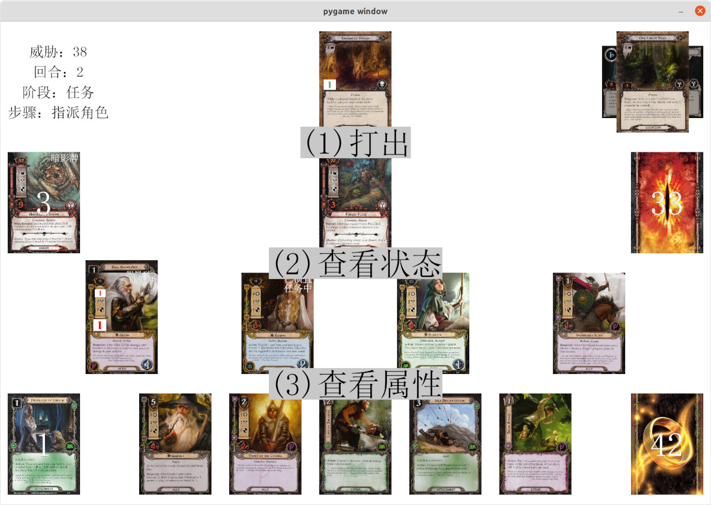
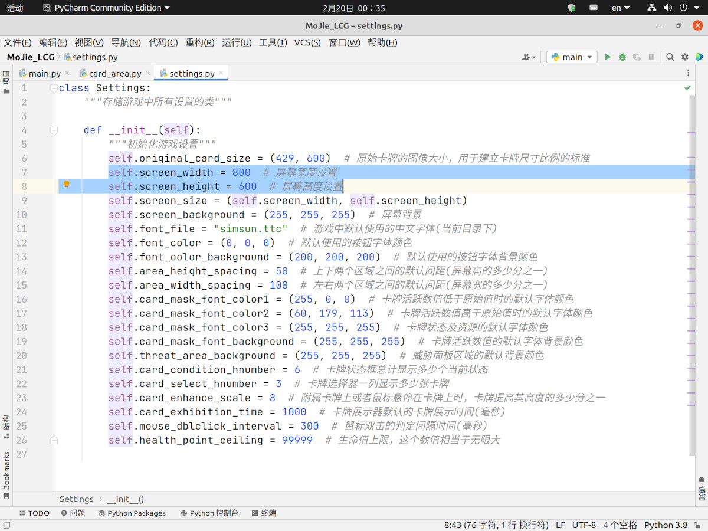
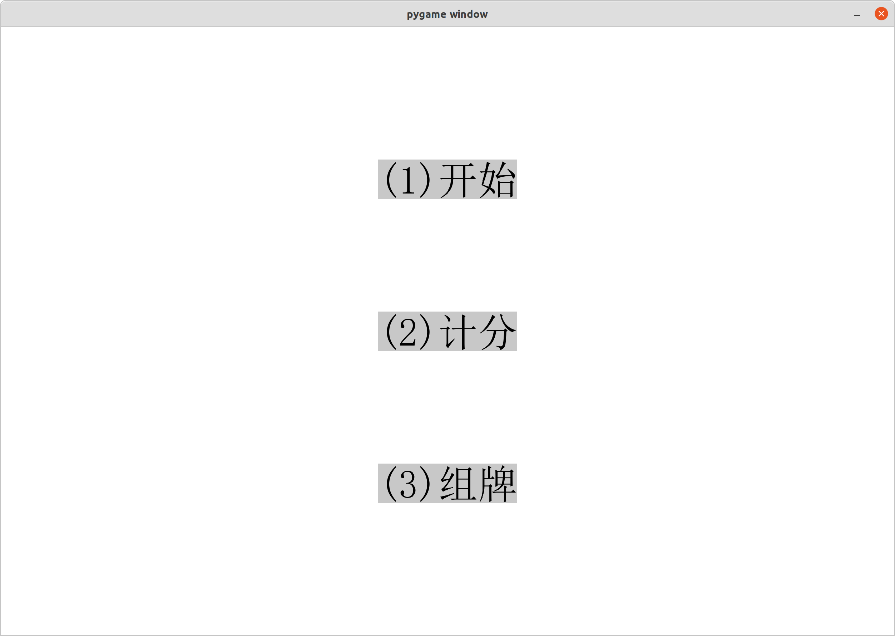
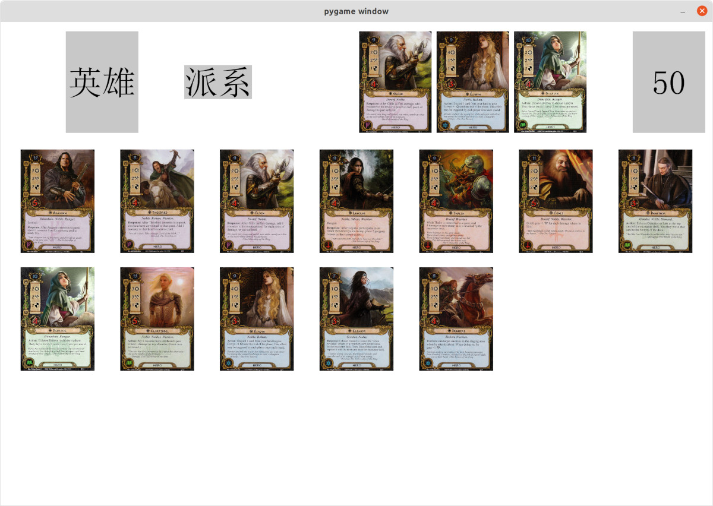
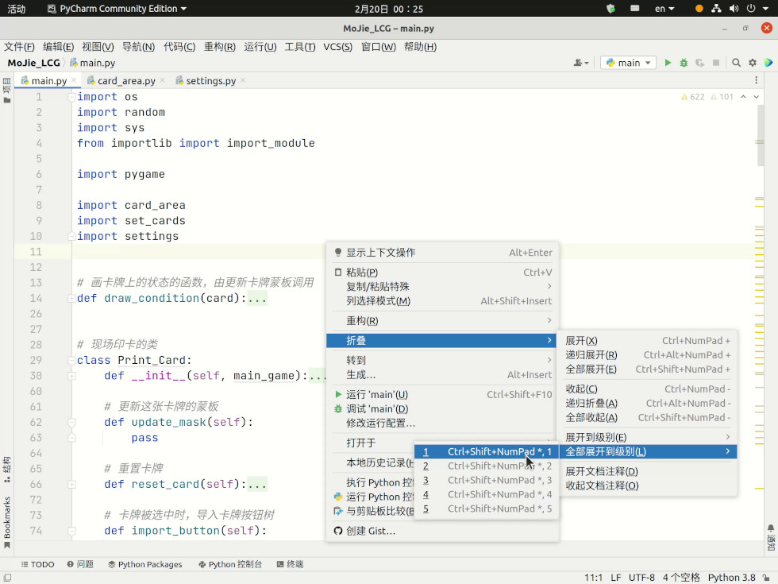
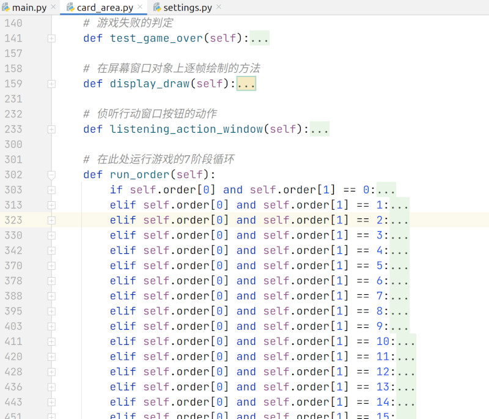

# 魔戒LCG 全自动单人版

## 介绍
本程序乃是复刻魔戒LCG中文卡牌，将这个有10年情怀的桌面纸牌游戏原封不动的搬到电脑上以供玩家单人快速体验其流程。 
游戏背景改编自英国作家J.R.R.托尔金著的长篇小说《魔戒》，玩家们将扮演一支英雄的队伍，努力完成艰难的任务。这些任务均发生在17年间－从比尔博庆祝111岁生日（佛罗多33岁那年）至佛罗多离开夏尔之前。游戏界面如下所示：

上图中左上角是信息区（同时也是胜利点卡牌区，由鼠标在其上双击来查看），右边是场景区，右上角是任务卡牌和激活的地区牌放置区。 
接下来的一行左、中、右分别是遭遇弃牌堆、交锋区和遭遇牌组区。倒数第二行是玩家打出的卡牌区（英雄和盟友都会放在这里）。 
左下角是玩家弃牌堆，中间是玩家的手牌区，右下角是玩家牌组。详细的操作说明会在之后给出。

## 软件架构
本程序在linux环境下（ubuntu 20.04）由Python3+Pygame编写而成，默认采用UTF-8字符集，暂未于其他平台例如windows下测试，但稍加修改应该可以于其他平台顺利运行，如需移植请自行摸索。

本程序复刻的游戏为老版魔戒（中文翻译采用游人码头的朱版），新版（A社邓版）与老版词汇对照在下面的参考资源给出。 
目前开发进度如下：
- [X] 基础版玩家卡
    - [X] 领导
    - [X] 战术
    - [X] 学识
    - [X] 精神
- [X] 任务及遭遇卡
    - [X] 穿越幽暗密林
        - [X] 简单难度
        - [X] 普通难度
        - [X] 噩梦难度
    - [X] 安度因河之旅
        - [X] 简单难度
        - [X] 普通难度
        - [X] 噩梦难度
    - [ ] 逃离多尔哥多（未做完）
        - [ ] 简单难度（未做完）
        - [ ] 普通难度（未做完）
        - [ ] 噩梦难度（未做完）
- [X] 组牌器
- [ ] 计分（未做）

### Linux下运行本程序

需要安装的环境如下：
1. Python 3.8.10+　(Ubuntu系统已经自带无需另行安装)
2. Pygame 2.0.4+ (一般由pip命令安装，并且其依赖包如下，都要先行安装)
    1. sdl2
    2. sdl2-gfx
    3. sdl2-image
    4. sdl2-mixer
    5. sdl2-ttf

## 运行教程

环境都安装完毕且无误之后，先打开目录下settings.py文件，修改窗口分辨率为合适自己屏幕的，注意不要修改的太极端，这里没有防错机制。

其他参数不建议修改，由于其注释已经足够清晰，不再多做详释。

之后可以直接在shell命令行下cd到游戏目录然后输入： 
python3 main.py 
来启动程序，本程序每次运行结束（赢/输一场游戏、退出组牌器）都会关闭，只需再次运行即可。

## 操作说明

 **(1)进入程序后弹出开始界面：** 

开始界面的按钮和在游戏界面中选中卡牌或行动阶段弹出的按钮是由相同的类控制，这些按钮不接受鼠标点选，而是直接由按下键盘数字键1-9（小键盘也行）来表示按下屏幕上对应按钮的操作，按键盘左上角Esc键返回上一层按钮选项。 
顺带一提，按钮类只支持按键1-9，但是可以显示更多的按钮，只是无法按选罢了（并不需要那么多），并且支持的按钮层数最大6层。同时按钮也被用来显示信息（如在游戏界面随便选中一张卡牌，会显示可以按下的按钮“查看状态”和“查看属性”，在下几层中便会显示按了也没什么用的按钮型信息）。

 **(2)开始界面按下3后可以进入组牌器：** 

组牌器左上角为分类展示，鼠标在对应的分类名上单击可以选择要在底下显示的卡牌类型，提供筛选机制； 
右边为要上场的英雄，鼠标左键在卡牌上单击可以卸下，右键查看详细信息； 
右上角为已经组好的牌组，其上的数字表示牌组中已经有了多少张牌，鼠标左键可以打开牌组来查看，右键直接清空牌组。 
打开右上角牌组查看器后用鼠标左键卸下卡牌，鼠标右键查看详细信息，用鼠标滚轮上下滚动显示或者用键盘上、下、左、右键（pageUP和pageDOWN键同左、右键），除了上述按键外按下任意键退出查看。 
组牌器下方是分类显示的所有卡牌，跟牌组查看器一样按鼠标左键让英雄上场或者加入玩家牌组，右键查看详细信息，用鼠标滚轮上下滚动... 
组好牌后按下键盘Enter键即可保存并退出程序（下次打开就是刚组的牌），如果不想保存则按下Esc键或关闭程序窗口直接退出。

 **(3)开始界面按1并选择完后面的选项后进入游戏界面：** 

游戏界面的操作遵循这样的思路－在卡牌上按鼠标左键为选择这张卡牌，选中后会弹出这张卡牌对应的按钮选项以执行对应的功能，鼠标右键打开这张卡牌的详细展示信息（中文），在展示界面任意按下鼠标键盘就会退出展示，另外游戏翻开遭遇卡和暗影牌时也会展示卡牌，这个展示有可以设置的展示时间，过后移动一下鼠标就会退出。然后在对应的区域上双击鼠标左键的话可以打开一个卡牌选择器来查看这个区域中所有的卡牌，在卡牌选择器中的操作类似于组牌器中的操作，只是必须选择一张卡牌来返回游戏界面，选中的这张卡牌会被设置为选中状态（游戏中需要玩家选择一张卡牌时也会由程序调用选择器，但之前并不会进行提示，所以请自行熟悉游戏流程）。

游戏界面的按键说明：按空格键即可进入下一步骤（或阶段）；按Enter键跳过本阶段；按CAPS_LOCK大小写切换键打开或关闭手动扣费（默认小写模式打出卡牌时会从合宜英雄上自动随机扣费）；按Esc键返回按钮的上一层或者取消选择卡牌。

 **(4)游戏胜利或者失败后的界面：** 

按Enter或者Esc键退出程序。

## 开发说明

目前本程序皆由我一个人利用业余时间开发完成，是我自学完Python后做的第一个游戏项目，其中各种代码的格式、语句还有设计的稚嫩之处还请海涵。 
代码中有不懂之处可以加本人qq：565060873，或者发送电子邮件至：565060873@qq.com，有时间我定会解答，并且一起学习进步！ 
游戏目录下各文件说明如下：
| 文件/文件夹    | 说明          |
|--------------|-------------|
| main.py      | 程序入口        |
| card_area.py | 所有区域的类      |
| set_cards.py | 组牌器         |
| settings.py  | 游戏设置        |
| 卡牌库        | 让组牌器找到所有玩家牌  |
| 玩家牌组      | 组好的玩家牌      |
| 魔戒LCG/      | 里面的每张卡都单独写类 |

在阅读程序代码时，最好用集成开发环境折叠代码，否则可能会看得头晕：

游戏的7个阶段循环写在card_area.py里的此处，折叠以方便修改查看：

## 参考资源

1. [基础版规则说明书](resources/rd.md)
2. [规则FAQ](resources/faq.md)
3. [新旧版本词汇对照](resources/newold.md)
4. [Ringsdb](https://ringsdb.com/ "在线查卡/组卡")
5. [比翁之家](http://hallofbeorn.com/LotR "所有卡牌应有尽有")
6. [OCTGN](https://expectingmischief.wordpress.com/ "半自动魔戒LCG多人游玩程序")

本程序中的所有图片、商标均来自互联网，其版权归Fantasy Flight Publishing,Inc.公司所有，请传播者自行遵守相关版权的法律规定。 
特别感谢银星计划提供的翻译、帮助及支持，其魔戒LCG的QQ交流群为：530561771